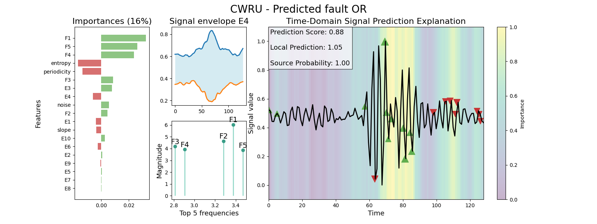

# diffLIME

This repository contains the source code accompanying the paper *DiffLIME: Enhancing Explainability with a Diffusion-Based LIME Algorithm for Predictive Maintenance*. The paper introduces a novel Explainable AI (XAI) algorithm that extends the widely used Local Interpretable Model-agnostic Explanations (LIME) framework. 

Our proposed method leverages a conditioned Probabilistic Diffusion Model to generate perturbed samples in the neighborhood of a given input. This approach improves LIME's capacity to provide meaningful explanations, particularly for fault diagnosis tasks in predictive maintenance. The methodology is validated using multiple rotating machinery diagnosis datasets, demonstrating its effectiveness in enhancing model interpretability.

Explore this repository to find the implementation details and evaluation scripts used in the study.

## Repository Structure  

```
src
├── phm_framework # base framework directory
│    ├── data/ # Meta-attributes and syntethic dataset generation
│    ├── nets/ # Implementations of 1D-CNN and DPMs
│    ├── notebooks/ # Notebooks with the experimentations
│    └── xai/ # LIME and DiffLIME implementations, metrics and plotting functions
│    
├── weights # weights of the model trained during experimentations
│
└── README.md # This file
```

### Directory Descriptions

- **`phm_framework/data/`**  
  Contains scripts and utilities for generating synthetic datasets and extracting meta-attributes required for experiments.

- **`phm_framework/nets/`**  
  Includes implementations of the 1D-CNN models and Diffusion Probabilistic Models (DPMs) used in the experiments.

- **`phm_framework/notebooks/`**  
  Contains Jupyter notebooks showcasing the experimentation process, step-by-step analyses, and visualizations.

- **`phm_framework/xai/`**  
  Houses the core implementations of LIME and DiffLIME algorithms, utility functions for metric calculations, and plotting functions to visualize results.

- **`weights/`**  
  Stores the weights of models trained during the experimentation phase, allowing for quick replication of results without retraining.

## Explanation plot generate by DiffLIME
The following graphs provide an example of the output generated by DiffLIME.

 - **Right Panel**: Displays the time-domain importances, highlighting the most significant regions of the signal for a specific prediction.
 - **Left Panel**: Shows additional meta-attributes incorporated into the explanation, enabled by the enhancements introduced with Diffusion Probabilistic Models (DPMs).
 - **Center Panel**: Presents the top 5 frequencies with the highest magnitudes and the signal envelope associated with the analyzed signal.

The Ex attributes refer to the 10 cluster envelopes extracted from the source dataset, providing further context for the interpretation of the model's decisions.



## ACKNOWLEDGMENT
This work has been supported by Grant PID2023-147198NB-I00 funded by MICIU/AEI/10.13039/501100011033 (Agencia Estatal de Investigación) and by FEDER, UE, and by the Ministry of Science and Education of Spain through the national program “Ayudas para contratos para la formación de investigadores en empresas (DIN2019-010887 / AEI / 10.13039/50110001103)”, of State Programme of Science Research and Innovations 2017-2020.


